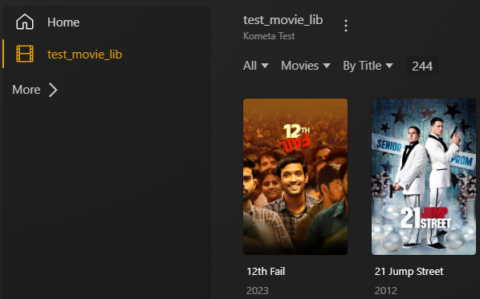

I’ve removed some of the lines for space, but have left the important bits:

``` { .shell }
...
|                                            Starting Run|
...
| Locating config...
|
| Using /Users/mroche/Kometa/config/config.yml as config
...
| Connecting to TMDb...
| TMDb Connection Successful
...
| Connecting to Plex Libraries...
...
| Connecting to Movies-NOSUCHLIBRARY Library...                                                      |
...
| Plex Error: Plex Library Movies-NOSUCHLIBRARY not found                                            |
| Movies-NOSUCHLIBRARY Library Connection Failed                                                     |
|====================================================================================================|
| Plex Error: No Plex libraries were connected to                                                    |
...
```

You can see there that Kometa found its config file, was able to connect to TMDb, was able to connect to Plex, and then failed trying to read the “Movies-NOSUCHLIBRARY" library, which of course doesn’t exist.

Open the config file again and change "Movies-NOSUCHLIBRARY" to reflect *your own* Movie library in Plex.

Since we're using the `plex-test-libraries` media, our Movie library is called “test_movie_lib", so mine looks like this:

```yaml
libraries:
  test_movie_lib:                            ## <<< CHANGE THIS LINE
    collection_files:
      - default: basic               # This is a file within the defaults folder in the Repository
      - default: imdb                # This is a file within the defaults folder in the Repository
      # see the wiki for how to use local files, folders, URLs, or files from git
```

At this point, the top bit of your config file should look like this:

```yaml
libraries:
  THE_NAME_OF_YOUR_MOVIE_LIBRARY:         ## <<< CHANGE THIS LINE
    collection_files:
      - default: basic               # This is a file within the defaults folder in the Repository
      - default: imdb                # This is a file within the defaults folder in the Repository
      # see the wiki for how to use local files, folders, URLs, or files from git
```

Where `THE_NAME_OF_YOUR_MOVIE_LIBRARY` has been replaced by the name of your movie library as shown in Plex ["test_movie_lib" here]:


