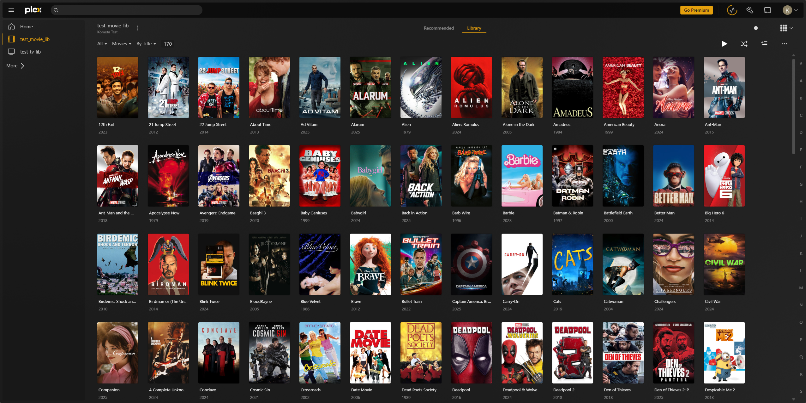
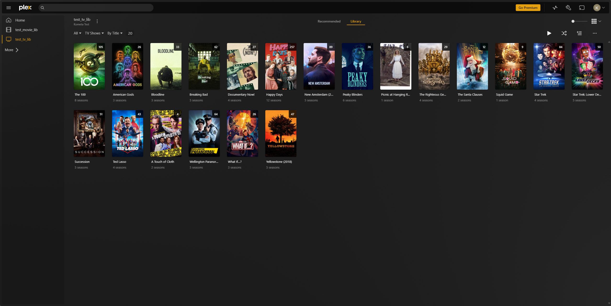

While going through this process, Kometa is going to load the movies in your library, create some collections, and apply some overlays.  If you have a large library, this will be very time-consuming.

For best results *with this walkthrough*, your test library will contain:

 - At least two comedy movies released since 2012.
 - At least two movies from the [IMDB top 250](https://www.imdb.com/chart/top/).
 - At least two movies from [IMDb's Popular list](https://www.imdb.com/chart/moviemeter).
 - At least two movies from [IMDb's Lowest Rated](https://www.imdb.com/chart/bottom).
 - A couple different resolutions among the movies.

For learning and testing, we will be taking advantage of the [`plex-test-libraries` repository](https://github.com/chazlarson/plex-test-libraries) which contains pre-made videos to use when following this guide.

Using the plex-test-libraries repository will ensure we have enough variety in media to populate the example collections that will be created. Running some of these default collections against a library of a few thousand movies can take hours, and for iterative testing it's useful to have something that will run in a few minutes or seconds.

Navigate to wherever you want to store these pre-made videos and then type:

``` { .shell }
git clone https://github.com/chazlarson/plex-test-libraries
cd plex-test-libraries
```

You should now see 2 folders, `test_tv_lib` and `test_movie_lib`. You will want to mount each of these to a library within Plex, as showcased here:

??? success "Test Plex Libraries (Click to Expand)"

    Library Name: `test_movie_lib`

    { width="600" }

    Library Name: `test_tv_lib`

    { width="600" }
